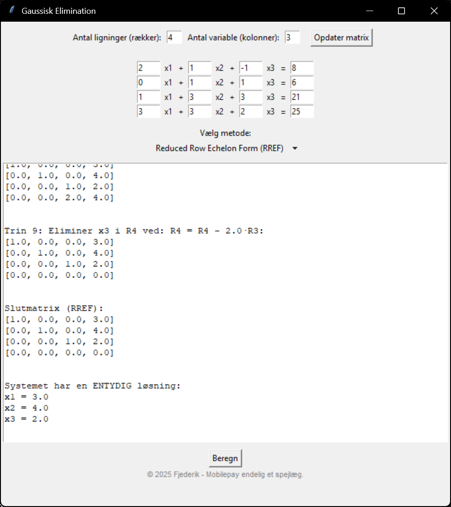

# LMEK Gaussisk Elimination
*Din (måske) bedste ven til eksamen i Lineær Matematisk Analyse og Elektriske Kredsløb*


## Hvad er det her?

Et lille, stille og roligt Tkinter-program, der hjælper dig med at løse lineære ligningssystemer med Gaussisk elimination – uden at du selv skal bøvle med 1'ere, 0'ere og frustrerede brøker. 

Ja, det er lavet til **LMEK-forberedelse (Forår 2025, Aarhus Universitet)**, men hey – det virker også udenfor eksamenslokalet.

---

## Funktioner

- Indtast matrix og højreside uden Mathcad-helvede  
- Vælg mellem REF og RREF  
- Se ALLE udregningstrin 
- Fejlhåndtering 
- Valgfrie variabel navne
- Tager rå ligninger som input og sætter dem selv på standardform

---

## Sådan starter du det

### Kør med Python (klassikeren):

```bash
python main.py
```

### Lav en .exe uden terminal (til Windows):

```bash
pyinstaller --onefile --noconsole main.py
```

### Med et ikon 

```bash
pyinstaller --onefile --noconsole --icon=ikon.ico main.py
```

## Hvorfor bruge det?

Fordi:
- Du har stirret tomt på en matrix før.
- LMEK giver dig lyst til at ringe til en voksen.
- Det hjælper faktisk at se hele regneprocessen, især til eksamen og vejlederforsvar.
- Nogle eksamensopgaver kræver mellemregninger.

---

## Eksempel i aktion

### Trin 1: Indtast ligninger og tryk beregn



### Trin 2: Celebrate


---

## Udvikler

**Frederik Pedersen – aka. Fjederik**  
*Aarhus Universitet – Forår 2025*  
> _MobilePay endelig et spejlæg_ 🍳


## 🍀 Held og lykke til eksamen!

---